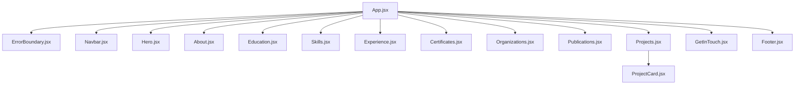

# Technical Architecture Documentation

This document outlines the software architecture, component relationships, data flow, and styling system for the portfolio.

---

## 1. Directory Structure

The project follows a modular, feature-oriented React folder structure:

```text
web-port/
├── assets/                 # Raw/compressed assets organized by section
├── docs/                   # Planning, roadmap, and design documentation
├── public/                 # Static public assets (e.g., favicon)
├── src/                    # Main source code
│   ├── components/         # Reusable React components
│   │   ├── About/          # About section, Capabilities cards, Quick Info
│   │   ├── Certificates/   # Credentials verification grid and modal
│   │   ├── Education/      # Academic journey timeline and focus area cards
│   │   ├── ErrorBoundary/  # Crash recovery container
│   │   ├── Experience/     # Work history timeline showing technoloy tags
│   │   ├── Footer/         # Dedicated copyright and status bar
│   │   ├── GetInTouch/     # Contact links and recruiter call-to-actions
│   │   ├── Hero/           # Splash screen greeting, stats, and profile image
│   │   ├── Navbar/         # Collapsible responsive header nav dropdowns
│   │   ├── OptimizedImage/ # Progressive image loader
│   │   ├── Organizations/  # Activities timelines and descriptions modals
│   │   ├── Projects/       # Dynamic sorting/search/filtering projects grid
│   │   └── Skills/         # Active technical categories and learning tracks
│   ├── data/               # Decoupled content databases (JSON files)
│   ├── hooks/              # Custom React lifecycle hooks
│   ├── App.jsx             # Top-level page assembler
│   ├── index.css           # Global layout variables & animations
│   ├── main.jsx            # Entry script
│   ├── utils.js            # General helper and math routines
│   └── vars.css            # Custom CSS properties and component variables
├── index.html              # HTML shell & SEO configuration
├── package.json            # Scripts and dependencies configurations
└── vite.config.js          # Vite and Rollup build rules
```

---

## 2. Component Architecture

All sections are built as isolated, highly cohesive components using **CSS Modules** to prevent global style leaks.



---

## 3. Data Architecture

Content is completely decoupled from rendering code. React components import static JSON arrays from `src/data/`, promoting maintainability and easy customization:

*   `skills.json`: Holds structured categories, proficiency percentages, tech clouds, and currently learning topics.
*   `history.json`: Holds chronological work entries, responsibility bullets, and `techStack` arrays.
*   `projects.json`: Defines categorized project cards, search keys, advisors, and live links.
*   `organizations.json`: Details student groups, leadership titles, achievements, and web links.
*   `publications.json`: Holds peer-reviewed research citations, DOIs, and recruiter-focused takeaway summaries.

---

## 4. Lifecycle Hooks & Custom Utilities

### Intersection Observer Hook (`src/hooks/useIntersectionObserver.js`)
*   Monitors viewport intersections to toggle rendering CSS visibility classes (like `.animate`, `.fadeInUp`, `.slideIn`).
*   Improves performance and UX by only triggering animations as elements enter the browser frame.

### Image Loader Utility (`src/utils.js`)
*   `getImageUrl`: Resolves asset paths relative to build outputs.
*   `lazyLoadImage`: Defers loading of offscreen images.
*   `getOptimalImageFormat`: Fallbacks to alternative file formats if modern options (like WebP) are unsupported by the client browser.

---

## 5. Build & Optimization Pipeline

Vite handles the module bundling process:
1.  **Manual Chunking**: Split vendor libraries (`react`, `react-dom`) from application scripts to optimize browser caching.
2.  **Terser Compression**: Minifies script outputs, strips `console.log` and `debugger` calls for production.
3.  **CSS Code Splitting**: Packages styles per-component to ensure clients only fetch styles relevant to rendered elements.
